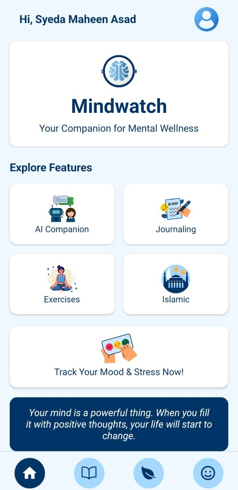

# 🧠 MindWatch – Mood & Health Tracker

<p align="center">Click on the image below to watch the demo video</p>

<p align="center">
  <a href="https://www.youtube.com/shorts/TgMM6biytZE" target="_blank">
    
  </a>
</p>


<p align="center">A smart application to track your mood and well-being based on health data inputs.</p>

---

## 📱 About the Project

**MindWatch** is a mobile app built to help users monitor their emotional and physical health through manually entered health metrics. Users can log their heart rate, blood pressure, and blood oxygen levels and track how these metrics correlate with their mood over time. This app aims to promote self-awareness and mental well-being through data-driven insights.

---

## 🔧 Tech Stack

- **Frontend:** React Native  
- **Mobile Testing:** Expo  
- **Backend:** Node.js with Express  
- **Database:** MongoDB

---

## 🚀 Features

- 📈 Track health metrics (heart rate, blood pressure, oxygen levels)  
- 😌 Log moods and emotions manually  
- 📊 View personalized trends and historical data  
- 🧭 Simple and clean interface for smooth user interaction  
- ☁️ Real-time sync with backend via API  

---

## 📦 How to Run Locally

### 1. Clone the repository

```bash
git clone https://github.com/YourUsername/mindwatch.git
cd mindwatch
```

### 2. Install frontend dependencies

```bash
npm install
```

### 3. Start the app with Expo

```bash
npx expo start
```
Scan the QR code with Expo Go on your phone to run the app.

### 4. Set up the backend

```bash
cd auth-backend
npm install
node server.js
```
Make sure MongoDB is running locally, or create a .env file in the backend directory with the following:
```bash
MONGO_URI=mongodb://localhost:27017/mindwatch
```
